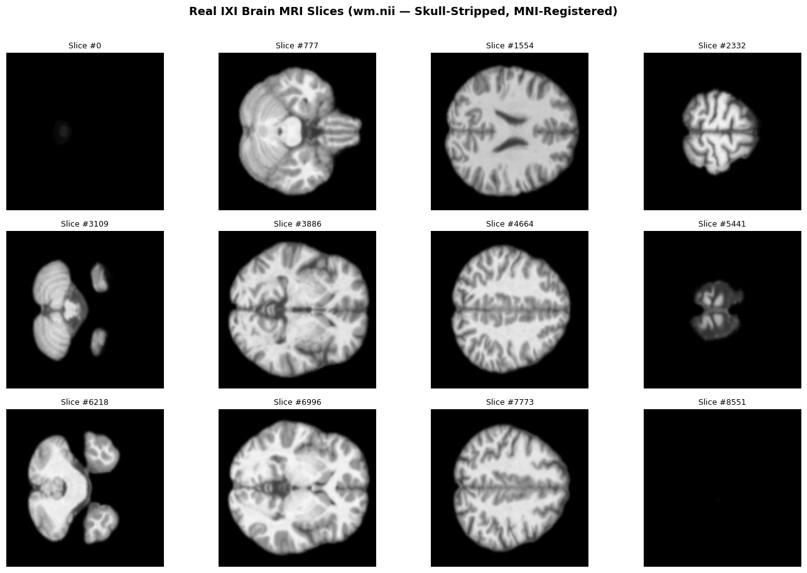
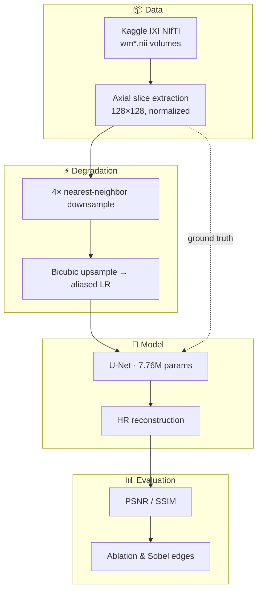
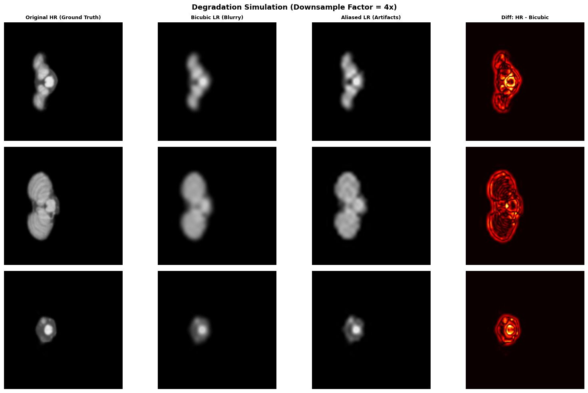
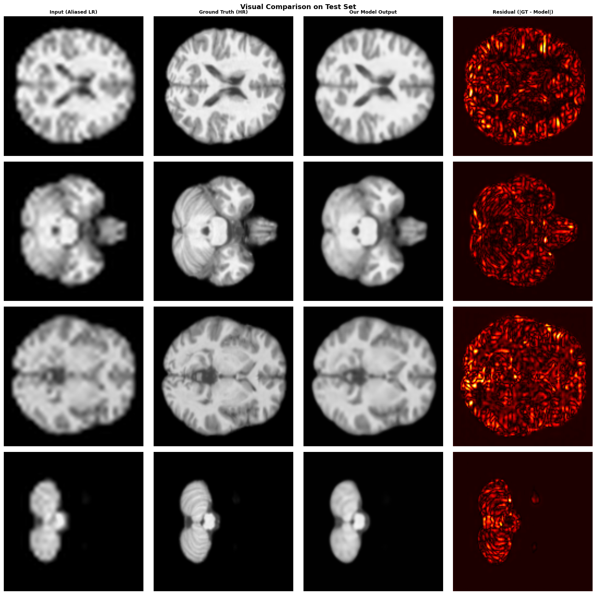
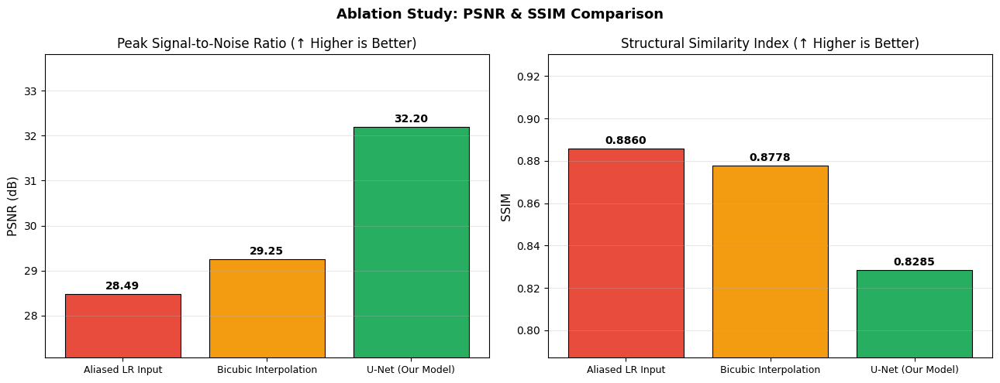
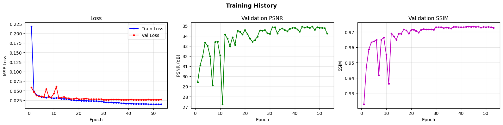
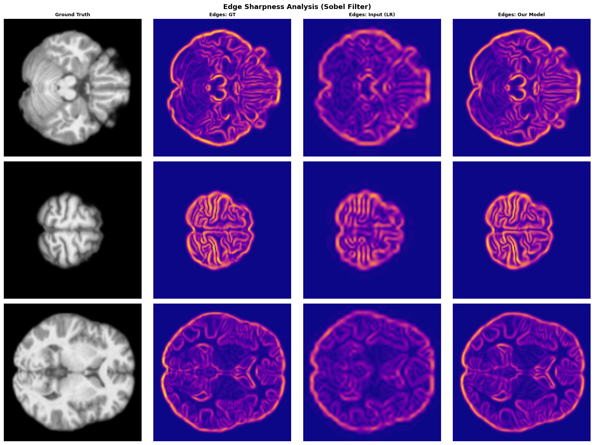

<p align="center">
  
</p>

<h1 align="center">🧠 SMORE — MRI Super-Resolution & Anti-Aliasing</h1>

<p align="center">
  <strong>Digital Image Processing · Advanced Course Project</strong>
</p>

<p align="center">
  <a href="https://github.com/kashif-techdev/smore"></a>
  
  
  
  
  <a href="https://github.com/kashif-techdev/smore/actions/workflows/ci.yml"></a>
</p>

<p align="center">
  Muhammad Kashif (231568) · Abdulrehman Afaq (231577) · Umair Habib (231694)
</p>

---

## Overview

This repository implements an **SMORE-inspired** pipeline for **2D brain MRI super-resolution** and **anti-aliasing restoration**, developed as a Digital Image Processing (DIP) capstone project. We train a **U-Net** to recover high-resolution (HR) axial slices from synthetically degraded low-resolution inputs that mimic **nearest-neighbor downsampling artifacts**—a practical analogue to missing anti-aliasing in acquisition or reconstruction chains.

The work is motivated by:

> **SMORE:** *A Self-Supervised Anti-Aliasing and Super-Resolution Algorithm for MRI Using Deep Learning*  
> Zhao et al., IEEE Transactions on Medical Imaging, 2021 · [DOI: 10.1109/TMI.2020.3037187](https://doi.org/10.1109/TMI.2020.3037187)

Our implementation is a **supervised U-Net baseline** on real **IXI** NIfTI volumes (skull-stripped, MNI-registered), with rigorous **PSNR / SSIM** evaluation and ablation against classical bicubic upsampling.

### What's new in v1.1

| Feature | Description |
|---------|-------------|
| **Subject-level splits** | Train/val/test partitioned by **patient**, preventing slice leakage across splits |
| **MSE + SSIM loss** | Differentiable `CombinedLoss` (weights `1.0` / `0.2`) for better structural quality |
| **CI smoke tests** | GitHub Actions runs `scripts/smoke_test.py` on every push |
| **CITATION.cff** | Machine-readable citation metadata for GitHub/Zenodo |

> Figures below are from the **v1.0** run (slice-level split, MSE-only). Re-run the notebook after pulling v1.1 to refresh metrics with subject splits and combined loss.

---

## Key Results

| Method | PSNR ↑ (dB) | SSIM ↑ |
|--------|-------------|--------|
| Aliased LR input (baseline) | 28.49 | 0.8860 |
| Bicubic interpolation | 29.25 | 0.8778 |
| **U-Net (ours)** | **32.20** | 0.8285 |
| **Gain vs. bicubic** | **+2.95 dB** | — |

> **Takeaway:** The network improves **pixel fidelity (PSNR)** substantially. v1.1 adds **SSIM loss** to improve structural similarity; re-train to update the metrics below.

**Best validation during training:** 32.06 dB PSNR · 0.829 SSIM (epoch 17, Tesla T4).

---

## Pipeline Architecture



### Degradation comparison

Nearest-neighbor downsampling **without** anti-aliasing introduces ringing and jagged structures; bicubic downsampling is smoother but blurrier. The model is trained to invert the **aliased** path.

<p align="center">
  
  <br/>
  <em>Ground truth vs. bicubic LR vs. aliased LR (4× factor)</em>
</p>

---

## Visual Results

### Super-resolution on test slices

<p align="center">
  
  <br/>
  <em>Low-resolution input · U-Net prediction · Ground truth (with per-image PSNR / SSIM)</em>
</p>

### Ablation study

<p align="center">
  
</p>

### Training convergence

<p align="center">
  
</p>

### Edge sharpness (Sobel)

SMORE’s clinical motivation includes preserving **anatomical boundaries**. Sobel magnitude maps show sharper structure in model outputs versus the degraded input.

<p align="center">
  
</p>

---

## Project Structure

```
smore/
├── notebooks/
│   └── SMORE_DIP_Project.ipynb   # Full pipeline (run top-to-bottom)
├── src/smore/
│   ├── losses.py                 # CombinedLoss, SSIMLoss
│   └── splits.py                 # subject_level_split()
├── scripts/
│   ├── smoke_test.py             # CI smoke tests
│   └── set_github_about.py       # Update repo description/topics (API)
├── docs/assets/                  # Figures for README & reports
├── .github/workflows/ci.yml
├── CITATION.cff
├── requirements.txt
├── LICENSE
└── README.md
```

---

## Dataset

| Item | Detail |
|------|--------|
| **Source** | [IXI Brain MRI](https://brain-development.org/ixi-dataset/) via [Kaggle (CAT12/SPM preprocessed)](https://www.kaggle.com/datasets/hamedamin/preprocessed-oasis-and-epilepsy-and-ixi) |
| **Files used** | `mri_IXI_480_2/wm*.nii` — skull-stripped, registered volumes |
| **Subjects in experiment** | 30 (of 397 available volumes) |
| **2D slices** | 3,201 axial slices @ 128×128 |
| **Split** | 70% train · 15% val · 15% test (**subject-level**, v1.1) |

The notebook downloads ~4.2 GB automatically through `kagglehub` on first run.

---

## Model & Training

| Component | Specification |
|-----------|----------------|
| **Architecture** | 4-level U-Net, skip connections, `base_features=32` |
| **Parameters** | 7,762,465 |
| **Input** | Aliased LR slice (1×128×128) |
| **Target** | HR slice (1×128×128) |
| **Loss** | MSE + SSIM (`CombinedLoss`, v1.1) |
| **Optimizer** | Adam (lr=1e-3, weight_decay=1e-5) |
| **Scheduler** | ReduceLROnPlateau |
| **Epochs** | 20 (early stopping, patience=5) |
| **Batch size** | 16 |
| **Hardware** | NVIDIA Tesla T4 (Google Colab) |

---

## Quick Start

### Option A — Google Colab (recommended)

1. Upload or open `notebooks/SMORE_DIP_Project.ipynb` in [Google Colab](https://colab.research.google.com/).
2. **Runtime → Change runtime type → T4 GPU**.
3. Run all cells sequentially. The dataset downloads once and is cached.

[](https://colab.research.google.com/github/kashif-techdev/smore/blob/main/notebooks/SMORE_DIP_Project.ipynb)

### Option B — Local machine

```bash
git clone https://github.com/kashif-techdev/smore.git
cd smore

python -m venv .venv
# Windows
.venv\Scripts\activate
# Linux / macOS
# source .venv/bin/activate

pip install -r requirements.txt
# Install PyTorch with CUDA: https://pytorch.org/get-started/locally/

jupyter notebook notebooks/SMORE_DIP_Project.ipynb
```

> **Note:** Training on CPU is possible but slow. A CUDA GPU is strongly recommended.

---

## Reproducibility Checklist

- [ ] GPU runtime enabled (Colab T4 or local CUDA)
- [ ] Run notebook cells in order (install → download → train → evaluate)
- [ ] Expect ~2–4 min training for 20 epochs on T4 (30 subjects)
- [ ] Outputs: `best_model.pth`, metric tables, and PNG figures

### Suggested improvements

| Change | Expected benefit |
|--------|------------------|
| `NUM_SUBJECTS` → 80+ | Better coverage of anatomy |
| 50–100 epochs | Lower loss, better convergence |
| Tune `SSIM_WEIGHT` (default `0.2`) | Balance PSNR vs perceptual quality |
| `base_features` 64 | Greater model capacity |

---

## Relation to the SMORE Paper

| Published SMORE | This repository |
|-----------------|-----------------|
| Self-supervised anti-aliasing + SR framework | Supervised U-Net (HR targets) |
| Full SMORE network & training objective | Standard encoder–decoder U-Net + MSE + SSIM |
| Paper-specific MRI evaluation protocol | 2D axial slices, synthetic 4× aliasing |

We cite SMORE as **conceptual motivation**; this repo is a **DIP teaching implementation**, not an official reproduction.

---

## References

1. Zhao, Y., et al. (2021). *SMORE: A Self-supervised Anti-aliasing and Super-resolution Algorithm for MRI Using Deep Learning.* IEEE TMI. https://doi.org/10.1109/TMI.2020.3037187  
2. IXI Dataset. https://brain-development.org/ixi-dataset/  
3. Preprocessed IXI (Kaggle). https://www.kaggle.com/datasets/hamedamin/preprocessed-oasis-and-epilepsy-and-ixi  

---

## Citation

If you use this repository, please cite our software ([`CITATION.cff`](CITATION.cff)) and the original SMORE paper (Zhao et al., IEEE TMI 2021).

## License

This project is released under the [MIT License](LICENSE).

---

<p align="center">
  <sub>Built with ❤️ for Digital Image Processing · 2026</sub>
</p>
